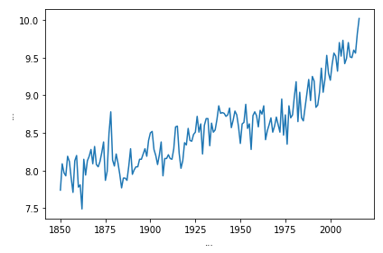

## 1. This is a Jupyter notebook!
<p>A <em>Jupyter notebook</em> is a document that contains text cells (what you're reading right now) and code cells. What is special with a notebook is that it's <em>interactive</em>: You can change or add code cells, and then <em>run</em> a cell by first selecting it and then clicking the <em>run cell</em> button above ( <strong>▶|</strong> Run ) or hitting <code>ctrl + enter</code>. </p>
<p></p>
<p>The result will be displayed directly in the notebook. You <em>could</em> use a notebook as a simple calculator. For example, it's estimated that on average 256 children were born every minute in 2016. The code cell below calculates how many children were born on average on a day. </p>


```python
# I'm a code cell, click me, then run me!
256 * 60 * 24 # Children × minutes × hours
```


    368640


## 2. Put any code in code cells
<p>But a code cell can contain much more than a simple one-liner! This is a notebook running python and you can put <em>any</em> python code in a code cell (but notebooks can run other languages too, like R). Below is a code cell where we define a whole new function (<code>greet</code>). To show the output of <code>greet</code> we run it last in the code cell as the last value is always printed out. </p>


```python
def greet(first_name, last_name):
    greeting = 'My name is ' + last_name + ', ' + first_name + ' ' + last_name + '!'
    return greeting

# Replace with your first and last name.
# That is, unless your name is already James Bond.
greet('James', 'Bond')
```


    'My name is Bond, James Bond!'


## 3. Jupyter notebooks ♡ data
<p>We've seen that notebooks can display basic objects such as numbers and strings. But notebooks also support the objects used in data science, which makes them great for interactive data analysis!</p>
<p>For example, below we create a <code>pandas</code> DataFrame by reading in a <code>csv</code>-file with the average global temperature for the years 1850 to 2016. If we look at the <code>head</code> of this DataFrame the notebook will render it as a nice-looking table.</p>


```python
# Importing the pandas module
import pandas as pd

# Reading in the global temperature data
global_temp = pd.read_csv('datasets/global_temperature.csv')

# Take a look at the first datapoints
# ... YOUR CODE FOR TASK 3 ...
```

## 4. Jupyter notebooks ♡ plots
<p>Tables are nice but — as the saying goes — <em>"a plot can show a thousand data points"</em>. Notebooks handle plots as well, but it requires a bit of magic. Here <em>magic</em> does not refer to any arcane rituals but to so-called "magic commands" that affect how the Jupyter notebook works. Magic commands start with either <code>%</code> or <code>%%</code> and the command we need to nicely display plots inline is <code>%matplotlib inline</code>. With this <em>magic</em> in place, all plots created in code cells will automatically be displayed inline. </p>
<p>Let's take a look at the global temperature for the last 150 years.</p>


```python
# Setting up inline plotting using jupyter notebook "magic"
%matplotlib inline

import matplotlib.pyplot as plt

# Plotting global temperature in degrees celsius by year
plt.plot(global_temp['year'], global_temp['degrees_celsius'])

# Adding some nice labels 
plt.xlabel('...') 
plt.ylabel('...') 
```


    <matplotlib.text.Text at 0x7f15145b9a20>





## 5. Jupyter notebooks ♡ a lot more
<p>Tables and plots are the most common outputs when doing data analysis, but Jupyter notebooks can render many more types of outputs such as sound, animation, video, etc. Yes, almost anything that can be shown in a modern web browser. This also makes it possible to include <em>interactive widgets</em> directly in the notebook!</p>
<p>For example, this (slightly complicated) code will create an interactive map showing the locations of the three largest smartphone companies in 2016. You can move and zoom the map, and you can click the markers for more info! </p>


```python
# Making a map using the folium module
import folium
phone_map = folium.Map()

# Top three smart phone companies by market share in 2016
companies = [
    {'loc': [37.4970,  127.0266], 'label': 'Samsung: 20.5%'},
    {'loc': [37.3318, -122.0311], 'label': 'Apple: 14.4%'},
    {'loc': [22.5431,  114.0579], 'label': 'Huawei: 8.9%'}] 

# Adding markers to the map
for company in companies:
    marker = folium.Marker(location=company['loc'], popup=company['label'])
    marker.add_to(phone_map)

# The last object in the cell always gets shown in the notebook
phone_map
```


## 6. Goodbye for now!
<p>This was just a short introduction to Jupyter notebooks, an open source technology that is increasingly used for data science and analysis. I hope you enjoyed it! :)</p>


```python
# Are you ready to get started with  DataCamp projects?
I_am_ready = True

# Ps. 
# Feel free to try out any other stuff in this notebook. 
# It's all yours!
```
