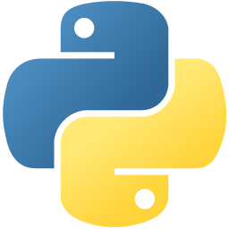

## DATACAMP PYTHON PROJECTS

### Hi there, I'm Khaleel aka Magnificvs (Magnificus) 👋

## I'm a Developer, Mystic and Dreamer

- 🔭 This repo will have DataCamp Project Solutions
- 🥅 Feel free to use but UNDERSTAND what the code does
- ⚡ PYTHON Code only

### Languages and Tools:

 

### DataCamp Python:

[Click Here for DataCamp Python Projects](https://learn.datacamp.com/projects/)  

  
PROJECTS

  
<!--START_SECTION:activity-->

1. ❗️ Introduction To Python Projects [HERE](docs/intro/index.html)

<!--END_SECTION:activity-->

